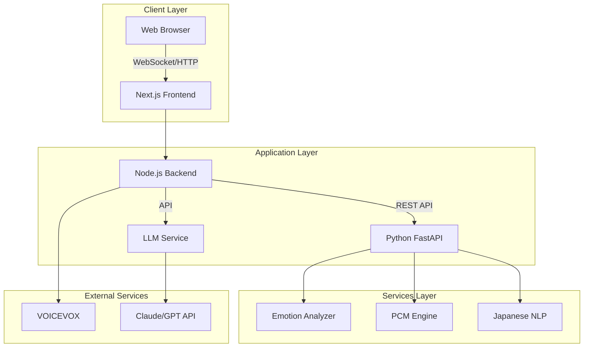
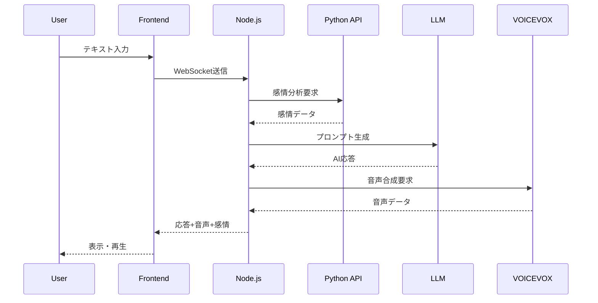

# システムアーキテクチャ概要

最終更新: 2024-06-06

## システム全体構成

ASD/NT模倣AITuberシステムは、TypeScript/Node.jsベースのフロントエンドとPython/FastAPIベースのバックエンドを組み合わせたハイブリッドアーキテクチャを採用しています。



## コンポーネント設計

### 1. フロントエンド（Next.js + TypeScript）

**責務:**
- ユーザーインターフェース提供
- VRMモデルの3D表示
- リアルタイム対話管理
- 状態管理とデータフロー制御

**主要コンポーネント:**
```typescript
interface FrontendComponents {
  AvatarSystem: {
    VRMLoader: "モデル読み込み";
    VRMRenderer: "3D描画";
    LipSync: "口パク同期";
    Expression: "表情制御";
  };
  
  ChatInterface: {
    MessageInput: "テキスト入力";
    VoiceInput: "音声入力";
    ResponseDisplay: "応答表示";
    EmotionIndicator: "感情表示";
  };
  
  ModeControl: {
    ASDNTToggle: "モード切替";
    PCMSelector: "パーソナリティ選択";
    SettingsPanel: "詳細設定";
  };
}
```

### 2. Node.jsバックエンド

**責務:**
- WebSocket通信管理
- LLM APIとの連携
- セッション管理
- リアルタイムデータストリーミング

**エンドポイント設計:**
```typescript
// API Routes
POST   /api/chat/message     // メッセージ送信
GET    /api/chat/history     // 履歴取得
POST   /api/voice/synthesize // 音声合成
WS     /ws/chat             // WebSocket接続

// Socket.IO Events
socket.on('message', handler)
socket.on('mode:change', handler)
socket.on('emotion:update', handler)
```

### 3. Python FastAPI（AI処理）

**責務:**
- 日本語自然言語処理
- 感情分析
- PCMパーソナリティ処理
- ASD/NT認知モデル実装

**API設計:**
```python
# エンドポイント
POST /api/v1/emotion/analyze
POST /api/v1/pcm/process
POST /api/v1/nlp/parse
GET  /api/v1/health

# データモデル例
class EmotionAnalysisRequest(BaseModel):
    text: str
    mode: Literal["ASD", "NT"]
    context: Optional[dict]

class EmotionAnalysisResponse(BaseModel):
    internal_emotion: EmotionState
    external_expression: EmotionState
    confidence: float
```

## データフロー

### 1. 会話処理フロー



### 2. モード切り替えフロー

```typescript
// ASD/NTモード切り替え時の状態変更
interface ModeTransition {
  from: "ASD" | "NT";
  to: "ASD" | "NT";
  changes: {
    languageProcessing: "literal" | "contextual";
    emotionExpression: number; // 0.0 - 1.0
    responsePattern: ResponsePattern;
  };
}
```

## セキュリティ設計

### 1. 認証・認可
- JWTトークンベースの認証（将来実装）
- APIキーの環境変数管理
- CORS設定による適切なアクセス制御

### 2. データ保護
- 個人情報の匿名化
- HTTPSによる通信暗号化
- 入力値のサニタイゼーション

### 3. レート制限
```typescript
// レート制限設定例
const rateLimiter = {
  chat: "10 requests/minute",
  emotion: "20 requests/minute",
  voice: "5 requests/minute"
};
```

## スケーラビリティ設計

### 1. 水平スケーリング戦略

```yaml
# Docker Compose によるスケーリング
services:
  web:
    scale: 3  # フロントエンド x3
  api:
    scale: 2  # Python API x2
  nginx:
    load_balance: round_robin
```

### 2. キャッシング戦略
- 音声合成結果のキャッシュ
- 感情分析結果の短期キャッシュ
- 静的アセットのCDN配信

### 3. 非同期処理
```python
# FastAPIの非同期処理例
@router.post("/analyze", response_model=EmotionResponse)
async def analyze_emotion(request: EmotionRequest):
    tasks = [
        analyze_sentiment(request.text),
        detect_emotion_keywords(request.text),
        calculate_emotion_intensity(request.text)
    ]
    results = await asyncio.gather(*tasks)
    return combine_results(results)
```

## モニタリング・ロギング

### 1. アプリケーションメトリクス
- レスポンスタイム
- エラー率
- 同時接続数
- API使用量

### 2. ログ設計
```typescript
// 構造化ログの例
logger.info({
  event: 'chat_message',
  userId: session.id,
  mode: 'ASD',
  responseTime: 250,
  timestamp: new Date().toISOString()
});
```

### 3. エラーハンドリング
- グレースフルデグレード
- ユーザーフレンドリーなエラーメッセージ
- 自動リトライメカニズム

## 技術的制約と対策

### 1. リアルタイム性能
**制約:** 50ms以下のレイテンシ要求
**対策:** 
- WebSocketによる双方向通信
- 音声ストリーミング
- 予測的プリフェッチ

### 2. 日本語処理の複雑性
**制約:** 慣用句・文脈理解の困難さ
**対策:**
- 複数のNLPライブラリ併用
- カスタム辞書の構築
- 機械学習モデルの継続的改善

### 3. 感情表現の制御
**制約:** ASD特性の適切な表現
**対策:**
- 内部感情と外部表現の分離
- 段階的な表現強度調整
- 専門家レビューによる検証

## 将来の拡張計画

### Phase 1（現在）
- 基本的な対話機能
- ASD/NTモード切り替え
- シンプルな感情表現

### Phase 2（3ヶ月後）
- PCM完全実装
- 音声対話機能
- 高度な感情分析

### Phase 3（6ヶ月後）
- マルチモーダル対話
- 学習分析機能
- API公開

## 参考資料

- [Next.js Documentation](https://nextjs.org/docs)
- [FastAPI Documentation](https://fastapi.tiangolo.com/)
- [Three.js VRM Examples](https://github.com/pixiv/three-vrm)
- [WebSocket Best Practices](https://socket.io/docs/v4/)
