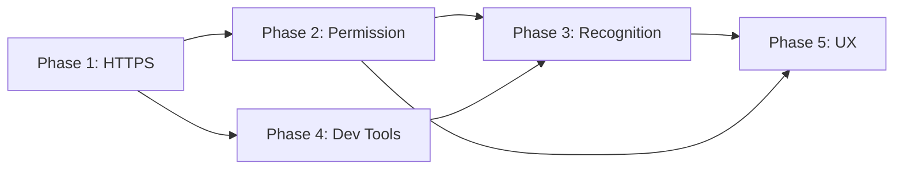

# Permission Bugfix Plan 2.0

## 🚨 Critical Issues Discovered

### Browser Testing Results
- ❌ `https://localhost:3002/chat` - Connection failed
- ⚠️ `http://localhost:3002/chat` - Accessible but microphone permission denied

### Root Cause Analysis
Based on aituber-kit reference implementation and HTTPS-SETUP.md analysis:

1. **HTTPS Requirement**: Microphone access is **BLOCKED** on non-HTTPS origins
2. **Permission Handling**: Current implementation has insufficient error handling
3. **Browser Compatibility**: Missing Firefox/Safari specific processing
4. **Development Environment**: No proper HTTPS setup for local development
5. **WebRTC Constraints**: WebRTC related restrictions not properly handled
6. **Mobile Browser Limitations**: Mobile-specific permission flows not implemented

## 📊 Dependency Matrix



## 👥 Resource Allocation

| Phase | Required Skills | Estimated Hours | Team Members |
|-------|----------------|-----------------|---------------|
| Phase 1 | DevOps, Security | 16-24h | 1-2 developers |
| Phase 2 | Frontend, Browser APIs | 24-32h | 2 developers |
| Phase 3 | Speech Recognition, ML | 32-40h | 2-3 developers |
| Phase 4 | Tooling, Automation | 16-24h | 1 developer |
| Phase 5 | UX/UI, Accessibility | 24-32h | 1 developer + 1 designer |

## 📋 Phase 1: HTTPS Environment Setup (CRITICAL)

### Priority: 🔴 URGENT
**Issue**: マイクロフォンアクセスはHTTPS環境でのみ動作する（ブラウザセキュリティ要件）

### Solution Options:

#### Option A: Chrome Dev Flag (Quick Fix)
```bash
# Chrome設定で一時的にHTTP localhostを安全扱い
chrome://flags/#unsafely-treat-insecure-origin-as-secure
# 設定値: http://localhost:3002
```
**注意**: これはあくまで開発用の暫定措置です。本番環境や CI へマージする前に必ず無効化してください。

#### Option B: mkcert + HTTPS Dev Server (Recommended)
```bash
# 信頼できる証明書でHTTPS開発環境
brew install mkcert
mkcert -install
mkcert localhost 127.0.0.1 ::1

# Next.js HTTPS設定
# next.config.js に証明書設定を追加
```

#### Option C: ngrok Tunnel (Alternative)
```bash
# 外部HTTPS経由でアクセス
brew install ngrok
ngrok http 3002
# https://xxx.ngrok.io でアクセス
```

### Implementation Tasks:
- [ ] 1.1: next.config.js にHTTPS設定追加
- [ ] 1.2: 証明書ファイル生成と配置
- [ ] 1.3: package.json に dev:https スクリプト追加
- [ ] 1.4: HTTPS-SETUP.md の手順更新
- [ ] 1.5: `dev:https` スクリプトにポート衝突検出・証明書存在チェック／自動再生成を追加
- [ ] 1.6: 証明書有効期限の監視と再生成ロジック実装

### Example HTTPS Configuration:
```javascript
// next.config.js
const fs = require('fs');
const https = require('https');

module.exports = {
  serverOptions: {
    https: {
      key: fs.readFileSync('./certificates/localhost-key.pem'),
      cert: fs.readFileSync('./certificates/localhost.pem')
    }
  }
};
```

### Rollback Plan:
1. Keep HTTP development server as fallback
2. Document HTTPS disable procedure
3. Maintain compatibility flags for 2 release cycles
4. Automated rollback trigger on >5% error rate

## 📋 Phase 2: Microphone Permission Manager Overhaul

### Priority: 🟡 HIGH

#### Issue 2.1: Insufficient Permission Checking
**Current Problem**: MicrophonePermissionManager needs aituber-kit level robustness

#### Reference Implementation Analysis (aituber-kit):
```typescript
// src/hooks/useBrowserSpeechRecognition.ts:98-124
const checkMicrophonePermission = useCallback(async (): Promise<boolean> => {
  // Firefox exclusion
  if (navigator.userAgent.toLowerCase().includes('firefox')) {
    toastStore.getState().addToast({
      message: t('Toasts.FirefoxNotSupported'),
      type: 'error',
      tag: 'microphone-permission-error-firefox',
    })
    return false
  }

  try {
    // Direct getUserMedia call with native browser modal
    const stream = await navigator.mediaDevices.getUserMedia({ audio: true })
    stream.getTracks().forEach((track) => track.stop())
    return true
  } catch (error) {
    console.error('Microphone permission error:', error)
    toastStore.getState().addToast({
      message: t('Toasts.MicrophonePermissionDenied'),
      type: 'error',
      tag: 'microphone-permission-error',
    })
    return false
  }
}, [t])
```

### Implementation Tasks:
- [ ] 2.1: Firefox/Safari ブラウザ検出と専用処理
- [ ] 2.2: getUserMedia 直接呼び出しでネイティブモーダル表示
- [ ] 2.3: DOMException 詳細エラーハンドリング
- [ ] 2.4: Permission API + getUserMedia フォールバック強化
- [ ] 2.5: Toast通知システム統合

#### Issue 2.2: Missing Error Recovery
**Current Problem**: No-speech エラーや権限拒否後の復旧処理不足

### Implementation Tasks:
- [ ] 2.6: no-speech エラー後の自動再試行ロジック
- [ ] 2.7: Permission denied からの回復手順提示
- [ ] 2.8: InvalidStateError (recognition already running) 処理
- [ ] 2.9: Connection timeout からの復旧処理
- [ ] 2.10: WebRTC constraint negotiation handling
- [ ] 2.11: Mobile browser permission flow adaptation
- [ ] 2.12: Cross-origin permission policy headers

## 📋 Phase 3: Speech Recognition System Enhancement

### Priority: 🟡 HIGH

#### Issue 3.1: Incomplete SpeechRecognition API Integration
**Current Problem**: ブラウザネイティブ SpeechRecognition API の活用不足

#### Reference Implementation Features (aituber-kit):
- Continuous recognition with auto-restart
- Silence detection with configurable timeout
- Initial speech timeout handling
- Speech/no-speech event differentiation
- Transcript change significance analysis

### Implementation Tasks:
- [ ] 3.1: SpeechRecognition continuous mode 実装
- [ ] 3.2: onspeechstart/onspeechend イベント処理
- [ ] 3.3: onresult での有意変化検出ロジック
- [ ] 3.4: onerror での詳細エラー分類と対応
- [ ] 3.5: Auto-restart mechanism (no-speech 後)

#### Issue 3.2: Missing Silence Detection
**Current Problem**: 無音検出ロジックが不完全

### Implementation Tasks:
- [ ] 3.6: useSilenceDetection hook 作成
- [ ] 3.7: Configurable silence timeout
- [ ] 3.8: Progress bar for silence countdown
- [ ] 3.9: Speech timestamp tracking
- [ ] 3.10: Automatic message sending on silence

## 📋 Phase 4: Development Environment Improvements

### Priority: 🟢 MEDIUM

#### Issue 4.1: Missing Development Tools
**Current Problem**: HTTPS開発環境の自動化不足

### Implementation Tasks:
- [ ] 4.1: Development SSL certificate auto-generation
- [ ] 4.2: pnpm dev:https コマンド追加
- [ ] 4.3: Browser auto-opening with HTTPS URL
- [ ] 4.4: Certificate expiry monitoring
- [ ] 4.5: Cross-platform compatibility (Windows/macOS/Linux)

#### Issue 4.2: Insufficient Debug Information
**Current Problem**: マイク権限関連のデバッグ情報不足

### Implementation Tasks:
- [ ] 4.6: Microphone permission status dashboard
- [ ] 4.7: Browser compatibility checker
- [ ] 4.8: HTTPS connection status indicator
- [ ] 4.9: Audio device enumeration and selection
- [ ] 4.10: Real-time permission monitoring

## 📋 Phase 5: User Experience Enhancements

### Priority: 🟢 MEDIUM

#### Issue 5.1: Poor Permission Denial UX
**Current Problem**: ユーザーが権限拒否した場合の案内不足

### Implementation Tasks:
- [ ] 5.1: Step-by-step permission grant instructions
- [ ] 5.2: Browser-specific help documentation
- [ ] 5.3: Video tutorial integration
- [ ] 5.4: Alternative input methods (keyboard, text)
- [ ] 5.5: Permission status persistent notification

#### Issue 5.2: Missing Fallback Options
**Current Problem**: マイク利用不可時の代替手段不足

### Implementation Tasks:
- [ ] 5.6: Text-only interaction mode
- [ ] 5.7: File upload for audio input
- [ ] 5.8: External microphone device guidance
- [ ] 5.9: Mobile device compatibility improvements
- [ ] 5.10: Screen reader accessibility

## 🎯 Revised Implementation Priority Matrix

### Week 1 (Immediate Response):
1. **Phase 1.1-1.4**: Basic HTTPS environment setup
2. **Phase 2.1-2.3**: Minimal permission management fixes
3. **Emergency hotfix release**

### Week 2 (Core Functionality):
4. **Phase 1.5-1.6**: HTTPS environment automation
5. **Phase 2.4-2.12**: Complete permission management implementation
6. **Phase 3.1-3.5**: Basic speech recognition features

### Week 3-4 (Quality Improvement):
7. **Phase 3.6-3.10**: Advanced speech recognition features
8. **Phase 4**: Development environment improvements
9. **Comprehensive testing implementation**

### Month 2 (UX Optimization):
10. **Phase 5**: User experience improvements
11. **Performance optimization**
12. **Documentation completion**

## 🔧 Testing Strategy

### Browser Testing Matrix:
- [ ] Chrome (latest) + HTTPS
- [ ] Firefox (latest) + HTTPS  
- [ ] Safari (latest) + HTTPS
- [ ] Edge (latest) + HTTPS
- [ ] Mobile Chrome/Safari + HTTPS
- [ ] Chrome on Android + HTTPS
- [ ] Safari on iOS + HTTPS
- [ ] Samsung Internet + HTTPS

### Automated Test Suite Example:
```typescript
// microphone-permission.test.ts
describe('Microphone Permission Tests', () => {
  it('should handle HTTPS requirement', async () => {
    expect(window.location.protocol).toBe('https:');
  });
  
  it('should recover from permission denial', async () => {
    // Mock permission denial
    const manager = new MicrophonePermissionManager();
    await manager.handlePermissionDenied();
    expect(manager.getRecoveryInstructions()).toBeDefined();
  });
  
  it('should detect silence correctly', async () => {
    const detector = new SilenceDetector({ timeout: 3000 });
    const result = await detector.detectSilence();
    expect(result.duration).toBeLessThan(3500);
  });
  
  it('should handle WebRTC constraints', async () => {
    const constraints = await negotiateWebRTCConstraints();
    expect(constraints.audio).toHaveProperty('echoCancellation');
  });
});
```

### Permission Testing Scenarios:
- [ ] First-time permission request
- [ ] Permission granted → denied → re-granted
- [ ] Permission denied → help instructions
- [ ] No microphone device available
- [ ] Multiple audio input devices

### Error Recovery Testing:
- [ ] Network interruption during recognition
- [ ] Browser background/foreground switching
- [ ] Tab switching during recognition
- [ ] Browser refresh with active permission
- [ ] Device disconnection/reconnection

### End-to-End (E2E) Testing:
- [ ] マイク権限許可／拒否フロー（Cypress もしくは Playwright）
- [ ] HTTPS 接続確認と証明書エラー検出
- [ ] WebRTC接続の安定性テスト
- [ ] モバイルブラウザでの権限フロー
- [ ] クロスオリジン環境でのテスト
- [ ] ネットワーク断続時の復旧テスト

## 📊 Success Metrics

### Technical Metrics:
- [ ] HTTPS connection success rate: 100%
- [ ] Microphone permission grant rate: >80%
- [ ] Speech recognition accuracy: >90%
- [ ] Error recovery success rate: >95%
- [ ] Average speech recognition latency: <500ms
- [ ] First-time setup success rate: >90%
- [ ] Memory leak occurrence: 0%
- [ ] WebRTC connection stability: >99%

**計測方法**: Google Analytics や Sentry のカスタムイベントを用いて、上記指標をダッシュボードで可視化する。

### User Experience Metrics:
- [ ] Permission denial → recovery rate: >70%
- [ ] User confusion incidents: <5%
- [ ] Support ticket reduction: >50%
- [ ] Cross-browser compatibility: 100%
- [ ] Mobile browser success rate: >85%
- [ ] Average time to first speech: <10s

## 🛡️ Risk Analysis and Mitigation

### Technical Risks:
1. **Certificate Auto-renewal Failure**
   - Mitigation: Implement monitoring and alerting
   - Fallback: Manual renewal procedure documented

2. **Browser API Changes**
   - Mitigation: Feature detection and polyfills
   - Fallback: Graceful degradation strategy

3. **WebRTC Connection Instability**
   - Mitigation: Implement reconnection logic
   - Fallback: Alternative audio capture methods

### Operational Risks:
1. **HTTPS Migration Downtime**
   - Mitigation: Staged rollout with canary deployment
   - Fallback: Quick rollback procedure

2. **User Impact During Transition**
   - Mitigation: Clear communication and documentation
   - Fallback: Temporary dual-protocol support

### Security Risks:
1. **Development Certificate Leakage**
   - Mitigation: Gitignore patterns and CI/CD checks
   - Fallback: Certificate revocation procedure

2. **Audio Data Privacy**
   - Mitigation: End-to-end encryption implementation
   - Fallback: Local-only processing option

## 📈 Monitoring and Alerting

### Error Tracking Implementation:
```javascript
// monitoring.ts
window.addEventListener('unhandledrejection', (event) => {
  if (event.reason?.name === 'NotAllowedError') {
    trackEvent('microphone_permission_denied', {
      browser: navigator.userAgent,
      timestamp: new Date().toISOString(),
      protocol: window.location.protocol,
      errorDetails: event.reason.message
    });
  }
});

// Performance monitoring
const performanceObserver = new PerformanceObserver((list) => {
  for (const entry of list.getEntries()) {
    if (entry.name.includes('speech-recognition')) {
      trackMetric('speech_recognition_latency', entry.duration);
    }
  }
});
performanceObserver.observe({ entryTypes: ['measure'] });
```

### Alert Thresholds:
- HTTPS connection failures > 1%
- Permission grant rate < 70%
- Speech recognition latency > 1000ms
- Error rate > 5%

## 🚀 Quick Start Commands

### Emergency HTTPS Setup:
```bash
# Option 1: Chrome Dev Flag
chrome://flags/#unsafely-treat-insecure-origin-as-secure
# Set: http://localhost:3002

# Option 2: mkcert (Recommended)
brew install mkcert
mkcert -install
mkcert localhost 127.0.0.1 ::1
# Then update next.config.js

# Option 3: ngrok
brew install ngrok  
ngrok http 3002
# Use provided HTTPS URL
```

### Verification Commands:
```bash
# Test HTTPS connection
curl -k https://localhost:3002/api/health

# Check certificate validity
openssl x509 -in localhost.pem -text -noout

# Browser permission test
# Navigate to: https://localhost:3002/chat
# Check DevTools → Console for permission errors
```

## 🚢 Staged Deployment Plan

### Stage 1: Canary Release (10% users)
- Duration: 48 hours
- Success criteria: Error rate < 2%
- Rollback trigger: Error rate > 5%

### Stage 2: Beta Release (25% users)
- Duration: 3 days
- Success criteria: All metrics within target
- Rollback trigger: Any metric 20% below target

### Stage 3: General Availability (100% users)
- Gradual rollout over 24 hours
- Real-time monitoring dashboard
- Instant rollback capability

### Backward Compatibility:
1. HTTP support maintained for 30 days
2. Legacy permission flow as fallback
3. Clear migration warnings in UI
4. Automatic upgrade prompts

## 📚 Additional Required Tasks

### Security and Compliance:
- [ ] Security audit post-HTTPS implementation
- [ ] GDPR compliance for audio data
- [ ] Accessibility audit (WCAG 2.1 AA)
- [ ] Penetration testing for WebRTC

### Performance and Quality:
- [ ] Load testing with 1000+ concurrent users
- [ ] A/B testing for UX improvements
- [ ] Performance profiling and optimization
- [ ] Memory leak detection and fixes

### Documentation and Training:
- [ ] API migration guide
- [ ] Video tutorials for users
- [ ] Internal developer documentation
- [ ] Support team training materials

---

**🎯 Expected Outcome**: Fully functional microphone permission system with HTTPS support, robust error handling, and excellent user experience across all major browsers.

**⏱️ Estimated Timeline**: 
- Week 1-2: Phases 1-3 (Core functionality)
- Week 3-4: Phase 4 (Development tools)
- Month 2: Phase 5 (UX optimization)
- Ongoing: Monitoring and iterative improvements

**🔄 Next Steps**: 
1. Execute Phase 1 HTTPS setup immediately to unblock browser testing
2. Set up monitoring infrastructure
3. Prepare rollback procedures
4. Begin canary deployment planning

**📊 Total Estimated Effort**: 112-152 developer hours across 4-6 weeks