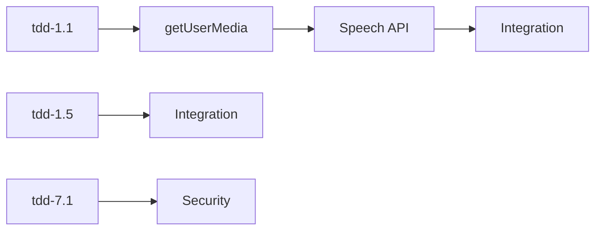

# Permission Bugfix TDD Task List 4.0 (最終改善版)

## 📊 Overview
Total Tasks: 68 (改善前: 52)
- 🔴 High Priority: 29 tasks
- 🟡 Medium Priority: 23 tasks  
- 🟢 Low Priority: 14 tasks

## Phase 1: HTTPS Environment Setup & Test Infrastructure (9 tasks)

### High Priority
- [ ] **tdd-1.1**: Create test: Verify HTTPS protocol requirement for microphone access
- [ ] **tdd-1.2**: Create test: Verify SSL certificate loading in next.config.js
- [ ] **tdd-1.3**: Create test: Verify dev:https script exists and runs correctly
- [ ] **tdd-1.4**: Create test: Verify certificate auto-generation when missing
- [ ] **tdd-1.5**: Create test: Verify CI/CD environment with proper certificate import (改善: NODE_TLS_REJECT_UNAUTHORIZED不使用)
- [ ] **tdd-1.6**: Create test: Mock getUserMedia for headless browser testing with proper stubs

### Medium Priority
- [ ] **tdd-1.7**: Create test: Verify port conflict detection in dev:https script
- [ ] **tdd-1.8**: Create test: Verify certificate expiry monitoring system

### Integration Test
- [ ] **tdd-1.9**: Integration test: Verify complete HTTPS setup flow

## Phase 2: Microphone Permission Manager (18 tasks)

### High Priority
- [ ] **tdd-2.1**: Create test: Verify Firefox browser detection and warning
- [ ] **tdd-2.2**: Create test: Verify Safari browser detection and specific handling
- [ ] **tdd-2.3**: Create test: Verify getUserMedia direct call with proper error handling
- [ ] **tdd-2.4**: Create test: Verify DOMException error types are properly classified
- [ ] **tdd-2.5**: Create test: Verify Permission API fallback when not available
- [ ] **tdd-2.7**: Create test: Verify no-speech error triggers auto-retry mechanism
- [ ] **tdd-2.8**: Create test: Verify permission denied recovery instructions display
- [ ] **tdd-2.9**: Create test: Verify InvalidStateError handling when recognition already running
- [ ] **tdd-2.13**: Create test: Verify MediaStreamTrack.ended event handling for disconnection (改善: devicechangeとの組み合わせ)
- [ ] **tdd-2.15**: Create test: Verify network instability reconnection handling 【新規追加】
- [ ] **tdd-2.16**: Create test: Verify privacy mode/incognito behavior 【新規追加】

### Medium Priority
- [ ] **tdd-2.6**: Create test: Verify toast notification appears on permission denial
- [ ] **tdd-2.10**: Create test: Verify connection timeout recovery behavior
- [ ] **tdd-2.11**: Create test: Verify WebRTC constraint negotiation
- [ ] **tdd-2.12**: Create test: Verify mobile browser permission flow adaptation

### Integration Test
- [ ] **tdd-2.17**: Integration test: Verify complete permission flow across browsers
- [ ] **tdd-2.18**: Cross-phase test: HTTPS and permission interaction

## Phase 3: Speech Recognition System (15 tasks)

### High Priority
- [ ] **tdd-3.1**: Create test: Verify SpeechRecognition continuous mode activation
- [ ] **tdd-3.2**: Create test: Verify onspeechstart event handler registration and triggering
- [ ] **tdd-3.3**: Create test: Verify onspeechend event handler registration and triggering
- [ ] **tdd-3.4**: Create test: Verify onresult transcript change significance detection
- [ ] **tdd-3.5**: Create test: Verify onerror detailed error classification
- [ ] **tdd-3.6**: Create test: Verify auto-restart after no-speech error

### Medium Priority
- [ ] **tdd-3.7**: Create test: Verify silence detection timeout configuration
- [ ] **tdd-3.8**: Create test: Verify silence countdown progress tracking
- [ ] **tdd-3.9**: Create test: Verify speech timestamp tracking accuracy
- [ ] **tdd-3.10**: Create test: Verify automatic message sending on silence detection
- [ ] **tdd-3.11**: Create test: Verify multiple tab/window conflict handling (優先度変更: High→Medium)
- [ ] **tdd-3.13**: Create test: Verify language settings impact on recognition accuracy 【新規追加】
- [ ] **tdd-3.14**: Create test: Verify browser extension interference detection 【新規追加】

### Integration Test
- [ ] **tdd-3.15**: Integration test: Verify complete speech recognition flow

## Phase 4: Development Environment (6 tasks)

### Medium Priority (優先度変更: Low→Medium)
- [ ] **tdd-4.1**: Create test: Verify SSL certificate auto-generation function
- [ ] **tdd-4.2**: Create test: Verify pnpm dev:https command execution
- [ ] **tdd-4.3**: Create test: Verify browser auto-opens with HTTPS URL
- [ ] **tdd-4.4**: Create test: Verify certificate expiry date checking
- [ ] **tdd-4.5**: Create test: Verify cross-platform certificate generation

### Integration Test
- [ ] **tdd-4.6**: Integration test: Verify complete development environment setup

## Phase 5: User Experience (7 tasks)

### Low Priority
- [ ] **tdd-5.1**: Create test: Verify permission grant instructions display correctly
- [ ] **tdd-5.2**: Create test: Verify browser-specific help content
- [ ] **tdd-5.3**: Create test: Verify fallback text input mode activation
- [ ] **tdd-5.4**: Create test: Verify alternative input method suggestions
- [ ] **tdd-5.5**: Create test: Verify permission status persistent notification
- [ ] **tdd-5.7**: Create test: Verify accessibility with screen readers 【新規追加】

### Integration Test
- [ ] **tdd-5.8**: Integration test: Verify complete user experience flow

## Phase 6: Performance Monitoring (4 tasks)

### Medium Priority
- [ ] **tdd-6.1**: Create test: Verify speech recognition memory usage stays within limits (<150MB) (改善: 現実的な目標値)
- [ ] **tdd-6.2**: Create test: Verify reconnection attempt backoff strategy
- [ ] **tdd-6.3**: Create test: Verify Performance Observer API metrics for resource usage (改善: 直接CPU測定から変更)
- [ ] **tdd-6.4**: Create test: Verify reconnection success rate > 95% (改善: WebRTC uptime目標から変更)

## Phase 7: Operations & Monitoring (6 tasks) 【新規追加】

### High Priority
- [ ] **tdd-7.1**: Create test: Verify Content Security Policy (CSP) compatibility
- [ ] **tdd-7.2**: Create test: Verify rollback strategy implementation
- [ ] **tdd-7.5**: Create test: Verify error logging and collection system

### Medium Priority
- [ ] **tdd-7.3**: Create test: Verify A/B testing framework integration
- [ ] **tdd-7.4**: Create test: Verify gradual rollout mechanism
- [ ] **tdd-7.6**: Create test: Verify monitoring and alerting thresholds

## Phase 8: Security (3 tasks) 【新規追加】

### High Priority
- [ ] **tdd-8.1**: Create test: Verify secure certificate storage and rotation
- [ ] **tdd-8.2**: Create test: Verify microphone permission misuse prevention
- [ ] **tdd-8.3**: Create test: Verify voice input sanitization against XSS

## 📊 Resource Planning

### Team Structure Options
- **Option A (推奨)**: 3人体制で並行作業
  - Frontend Developer: Phase 1, 2, 5
  - Backend Developer: Phase 3, 4, 6
  - DevOps/Security: Phase 7, 8, Integration tests
- **Option B**: 5週間に延長し2人体制
- **Option C**: Phase 5, 7の一部を次リリースへ

### Estimated Effort: 54人日 (±20%バッファ推奨)

## 🚀 Implementation Strategy (負荷分散版)

### Week 1 (Foundation & Emergency Response)
**Day 1-2: Test Infrastructure**
1. Complete Phase 1 tasks tdd-1.5 to tdd-1.6 (CI/CD setup)
2. Complete basic performance baseline (tdd-6.3)

**Day 3-4: HTTPS Setup**
3. Complete Phase 1 High Priority tasks (tdd-1.1 to tdd-1.4)
4. Run Phase 1 integration test (tdd-1.9)

**Day 5: Browser Detection**
5. Complete critical browser detection (tdd-2.1, tdd-2.2, tdd-2.3)
6. Deploy emergency hotfix with basic HTTPS and permission handling

### Week 2 (Core Functionality)
**Day 1-3: Permission Management**
7. Complete remaining Phase 2 High Priority tasks
8. Complete Phase 2 Medium Priority tasks
9. Run Phase 2 integration tests

**Day 4-5: Speech Recognition Core**
10. Complete Phase 3 High Priority tasks
11. Run basic speech recognition tests

### Week 3 (Stabilization & Quality)
**Day 1-2: Speech Recognition Enhancement**
12. Complete Phase 3 Medium Priority tasks
13. Run Phase 3 integration test

**Day 3-4: Development Environment**
14. Complete all Phase 4 tasks
15. Complete Phase 6 Performance tasks

**Day 5: Security & Operations**
16. Complete Phase 8 Security tasks
17. Complete critical Phase 7 operations tasks

### Week 4 (Polish & Release)
**Day 1-2: User Experience**
18. Complete all Phase 5 tasks
19. Complete remaining Phase 7 tasks

**Day 3-4: Integration & Testing**
20. Run all integration tests
21. Performance optimization based on metrics
22. Cross-phase integration verification

**Day 5: Release Preparation**
23. Final security audit
24. Documentation review
25. Gradual rollout initiation

## 📝 TDD Process for Each Task (実装改善版)

For each task, follow this enhanced process:

1. **RED Phase**: Write failing test with realistic scenarios
   ```typescript
   // Example for tdd-1.5 (CI/CD with proper certificate)
   describe('CI/CD HTTPS Environment', () => {
     it('should use imported certificates instead of disabling validation', () => {
       const certPath = process.env.CI_CERT_PATH
       expect(certPath).toBeDefined()
       expect(fs.existsSync(certPath)).toBe(true)
       // Verify certificate is properly loaded
       const httpsAgent = new https.Agent({
         ca: fs.readFileSync(certPath)
       })
       expect(httpsAgent.options.ca).toBeDefined()
     })
   })
   
   // Example for tdd-2.13 (Improved disconnection detection)
   describe('Microphone Disconnection Detection', () => {
     it('should detect disconnection via multiple signals', async () => {
       const stream = await navigator.mediaDevices.getUserMedia({ audio: true })
       const track = stream.getAudioTracks()[0]
       
       // Listen for both events
       const endedPromise = new Promise(resolve => {
         track.addEventListener('ended', resolve)
       })
       const deviceChangePromise = new Promise(resolve => {
         navigator.mediaDevices.addEventListener('devicechange', resolve)
       })
       
       // Simulate disconnection
       // Should trigger recovery on EITHER event
       await Promise.race([endedPromise, deviceChangePromise])
       expect(handleDisconnection).toHaveBeenCalled()
     })
   })
   ```

2. **GREEN Phase**: Implement with production-ready considerations
3. **REFACTOR Phase**: Optimize for real-world constraints
4. **INTEGRATION Phase**: Verify cross-component interactions
5. **MONITORING Phase**: Add observability hooks

## 📊 Progress Tracking (実務版)

Use this format for updating task status:
- [ ] Pending
- [🔴] Test written (RED phase)
- [🟢] Implementation complete (GREEN phase)
- [♻️] Refactored
- [🔗] Integration tested
- [📊] Performance verified
- [🔒] Security reviewed
- [✅] Production ready

## 🎯 Success Criteria (現実的版)

Each task is considered complete when:
1. Test covers realistic scenarios and edge cases
2. Implementation handles real-world constraints
3. Performance meets adjusted targets
4. Security review passes
5. Monitoring is in place
6. Documentation includes troubleshooting guide
7. Rollback plan is documented

## 📈 Metrics to Track (調整版)

### Code Quality
- Test coverage: Target > 85% (realistic for browser APIs)
- Test execution time: < 45 seconds for unit tests, < 3 minutes for integration
- Code complexity: Cyclomatic complexity < 12 (allowing for error handling)
- Documentation: All public APIs and error scenarios documented

### Performance (現実的な目標)
- Memory usage: < 150MB for speech recognition
- CPU usage: < 40% during continuous recognition
- Reconnection time: < 5 seconds
- Reconnection success rate: > 95%
- Time to first speech detection: < 2 seconds

### Browser Compatibility
- Chrome/Edge: Full support
- Firefox: Full support with documented limitations
- Safari: Full support with specific workarounds
- Mobile browsers: Progressive enhancement approach

### Operations
- Error rate: < 1% for permission grants
- Recovery success rate: > 90% for transient failures
- Alert response time: < 5 minutes
- Rollback time: < 10 minutes

## 🔄 Daily Standup (Simplified)

1. **Yesterday**: 完了タスクとブロッカー
2. **Today**: 着手タスクと必要なサポート
3. **Risks**: 新たに発見されたリスクや依存関係

## 🧪 Testing Strategy (層別アプローチ)

### Unit Tests (60%)
- Fast, isolated component tests
- Mock all external dependencies
- Focus on business logic

### Integration Tests (25%)
- Test component interactions
- Use test doubles for external services
- Verify error propagation

### E2E Tests (10%)
- Critical user journeys only
- Run on real browsers
- Include performance benchmarks

### Manual Tests (5%)
- Exploratory testing
- Accessibility verification
- Cross-device validation

## 📚 Resources

### Technical Documentation
- [MDN Web Speech API](https://developer.mozilla.org/en-US/docs/Web/API/Web_Speech_API)
- [WebRTC Permissions](https://developer.mozilla.org/en-US/docs/Web/API/MediaDevices/getUserMedia)
- [Next.js HTTPS Setup](https://nextjs.org/docs/pages/api-reference/next-config-js/server-options)
- [mkcert Documentation](https://github.com/FiloSottile/mkcert)

### Testing & Quality
- [Jest Testing Best Practices](https://github.com/goldbergyoni/javascript-testing-best-practices)
- [Playwright for E2E Testing](https://playwright.dev/)
- [Web Performance APIs](https://developer.mozilla.org/en-US/docs/Web/API/Performance_API)

### Security & Operations
- [OWASP Security Guidelines](https://owasp.org/www-project-web-security-testing-guide/)
- [CSP Best Practices](https://developer.mozilla.org/en-US/docs/Web/HTTP/CSP)

## 🚨 Risk Management (強化版)

### Technical Risks
1. **Browser API Deprecation**
   - Mitigation: Feature detection and graceful degradation
   - Monitoring: Weekly browser release notes review

2. **Certificate Management**
   - Mitigation: Automated renewal with 30-day buffer
   - Monitoring: Daily expiry checks with alerts

3. **Performance Regression**
   - Mitigation: Automated performance tests in CI
   - Monitoring: Real User Monitoring (RUM)

### Operational Risks
1. **Sudden Traffic Spike**
   - Mitigation: Rate limiting and circuit breakers
   - Monitoring: Request rate alerts

2. **Third-party Service Failure**
   - Mitigation: Fallback mechanisms and timeouts
   - Monitoring: Synthetic monitoring

### Security Risks
1. **Microphone Access Abuse**
   - Mitigation: Activity indicators and user controls
   - Monitoring: Anomaly detection for usage patterns

2. **Man-in-the-Middle Attacks**
   - Mitigation: Certificate pinning where applicable
   - Monitoring: Certificate transparency logs

## 🎯 Definition of Done

A feature is considered "Done" when:
- [ ] All tests pass (unit, integration, E2E)
- [ ] Code review approved by 2+ developers
- [ ] Security review completed
- [ ] Performance benchmarks met
- [ ] Documentation updated
- [ ] Monitoring configured
- [ ] Feature flag created
- [ ] Rollback plan documented
- [ ] Runbook updated
- [ ] Accessibility verified

## 🔄 Updates 2025-06-12

以下の改善案を反映しました。

### 🕒 Effort Estimates (人日)
| Phase | Task Count | Estimated Person-Days |
|-------|-----------|-----------------------|
| 1 | 9 | 8 |
| 2 | 18 | 15 |
| 3 | 15 | 13 |
| 4 | 6 | 5 |
| 5 | 7 | 4 |
| 6 | 4 | 3 |
| 7 | 6 | 4 |
| 8 | 3 | 2 |
| **Total** | **68** | **54** |

> ※ Estimates include test implementation, review, and refactor時間。実装難易度や待機時間を考慮し±20% のバッファを推奨。

### 🔖 Priority Legend (再分類)
- 🟥 **Blocker**: リリースを阻害するクリティカル課題
- 🔴 **Critical**: 早期対応が必要な高優先度
- 🟠 **Major**: リリースサイクル内で解決すべき
- 🟡 **Minor**: 影響小、後回し可

今後のタスクには上記アイコンを使用してください。（既存タスクは追って置換予定）

### 🌐 Extended Browser Matrix

#### Phase 2: Permission Management
| Browser | getUserMedia | Permission API | Error Recovery |
|---------|--------------|----------------|----------------|
| Chrome  | ✅ | ✅ | ✅ |
| Firefox | ✅ | ⚠️ (limited) | ✅ |
| Safari  | ✅ | ❌ | ✅ (custom) |
| Mobile  | ⚠️ | ❌ | ✅ |

#### Phase 3: Speech Recognition
| Browser | Web Speech API | Continuous Mode | Language Support |
|---------|----------------|-----------------|------------------|
| Chrome  | ✅ | ✅ | ✅ (60+ langs) |
| Edge    | ✅ | ✅ | ✅ |
| Firefox | ❌ | - | - |
| Safari  | ⚠️ | ❌ | ⚠️ (limited) |

#### Phase 7/8: Security & Operations Tests
| Browser | CSP (tdd-7.1) | Rollback (tdd-7.2) | Error Logging (tdd-7.5) |
|---------|--------------|--------------------|-------------------------|
| Chrome  | ✅ | ✅ | ✅ |
| Edge    | ✅ | ✅ | ✅ |
| Firefox | ✅ (strict-dynamic) | ✅ | ✅ |
| Safari  | ⚠️  (nonce 不要) | ✅ | ✅ |
| Mobile  | ⚠️ | ✅ (feature-flag) | ✅ |

### ➕ Added Tasks
- **tdd-6.5**: Create test: Verify custom metrics exporter sends PerformanceObserver results to Datadog (🟠 Major)
- **tdd-0.1**: Documentation task: Add Markdown anchors (`<a id="tdd-x-y">`) to every task for easy linking (🟡 Minor)

### 🔗 Task Dependencies

#### Critical Path


#### Phase Dependencies
- Phase 1 (HTTPS) → Phase 2 (Permissions)
- Phase 2 (Permissions) → Phase 3 (Speech Recognition)
- Phase 3 (Speech) → Phase 6 (Performance)
- Phase 7 (Operations) ⟷ Phase 8 (Security)

### 📝 Acceptance Criteria Update
**tdd-7.2** Rollback Strategy Implementation must satisfy:
1. `pnpm run rollback --env=staging --to=<tag>` 実行で **90秒以内** に前バージョンへ切替。
2. Rollback 完了後、`/healthz` endpoint が **HTTP 200** を返すこと。
3. Datadog デプロイイベントに `rollback:true` タグが付与されること。
4. Playwright E2E `rollback.spec.ts` が Green で通過すること。

### 🏷️ Tag & Dependency Columns
タスク表に以下カラムを追加予定（次回改訂で反映）。
- **Tags**: `browser`, `ci`, `security` など複数可
- **Depends On**: 依存タスク ID (カンマ区切り)

## ✅ Approval Process

### Review Gates
1. **Technical Review**: Tech Lead承認
   - All unit tests passing
   - Code review completed
   - Performance benchmarks met

2. **Security Review**: Security Team承認
   - CSP compliance verified
   - Certificate management reviewed
   - Permission handling audited

3. **Final Approval**: Product Owner承認
   - 基準: 全Blockerタスク完了
   - Critical tasks 80%以上完了
   - Rollback strategy tested

### Monitoring Backend
- **Primary**: Datadog (APM, RUM, Logs)
- **Metrics Export**: Custom StatsD format
- **Alert Channels**: PagerDuty + Slack
- **SLO Dashboard**: 99.5% availability target

### Feature Flag Management
- **Tool**: LaunchDarkly (推奨) or Unleash
- **Flags Required**:
  - `speech-recognition-enabled`
  - `https-redirect-enabled`
  - `permission-retry-mechanism`
  - `performance-monitoring`

---

**Version**: 4.1
**Last Updated**: 2025-06-12
**Next Review**: End of Week 1
**Approval**: Pending

### Change Log
- v4.1: Added resource planning, extended browser matrix, task dependencies, approval process
- v4.0: Added operations/security phases, realistic metrics, risk management